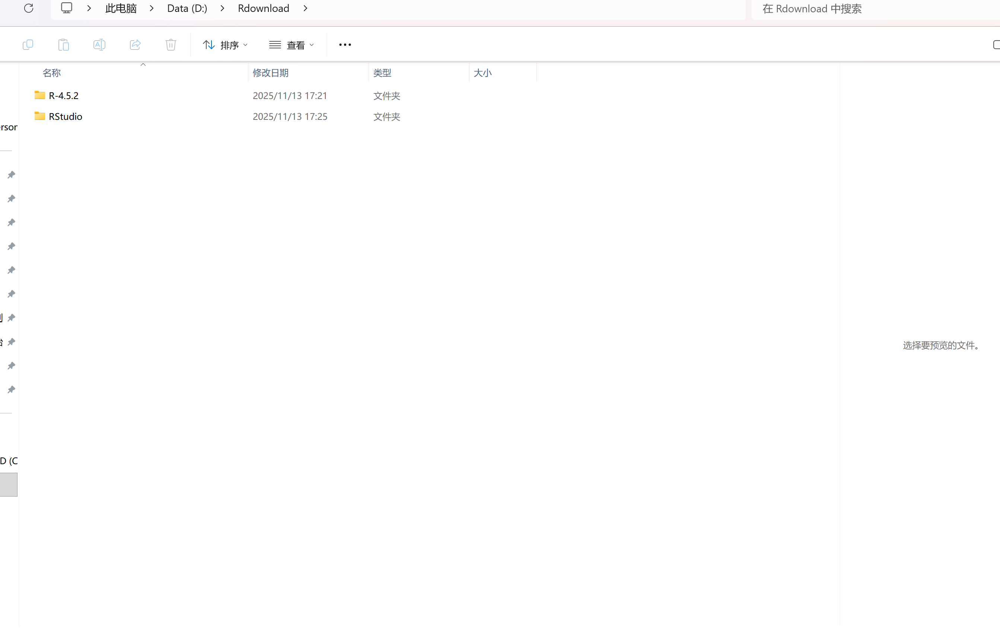
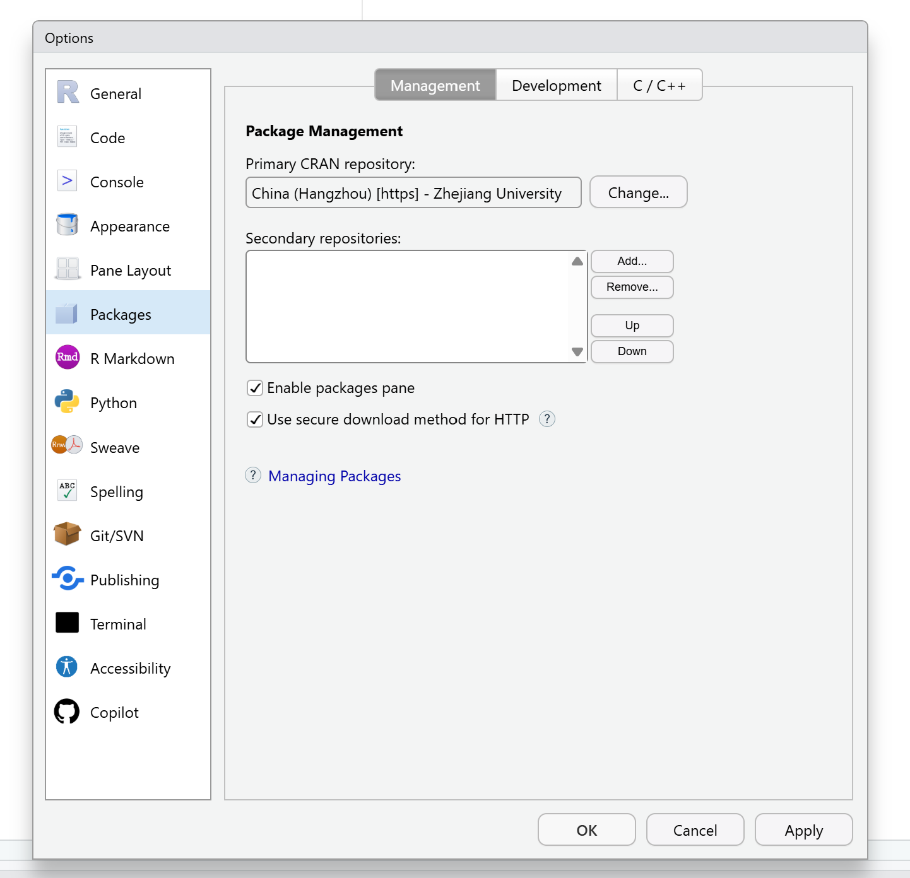
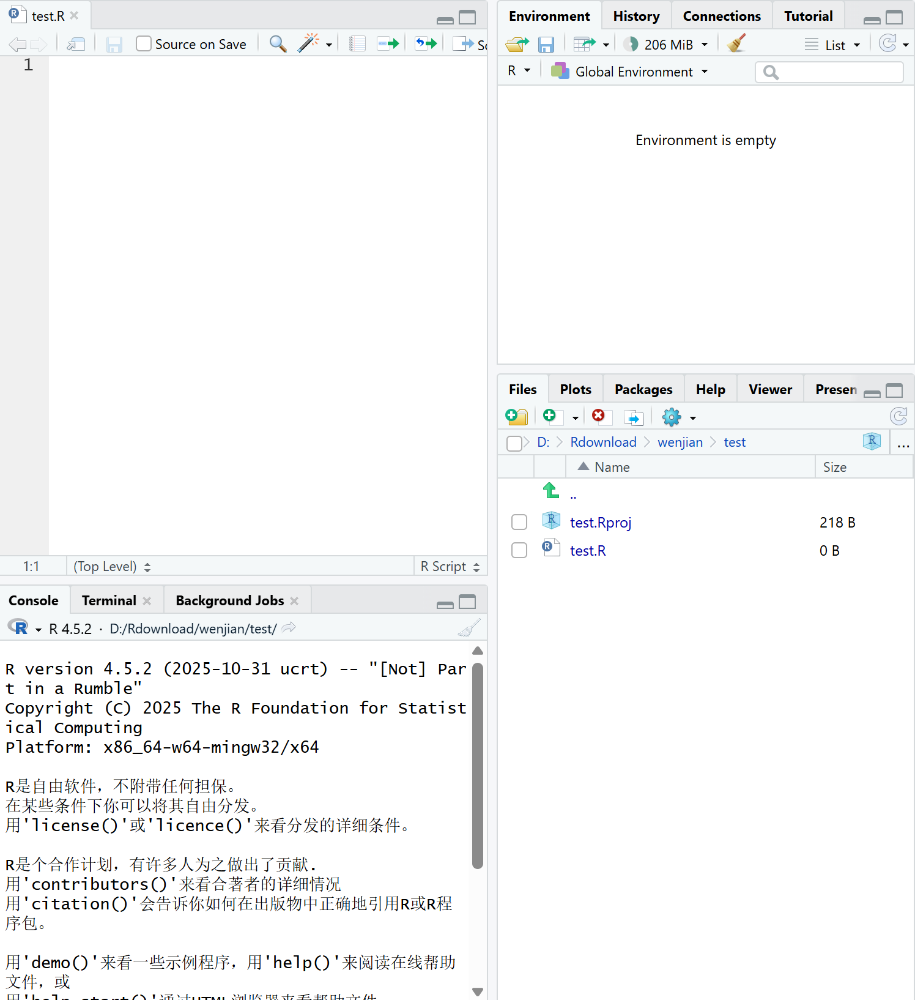
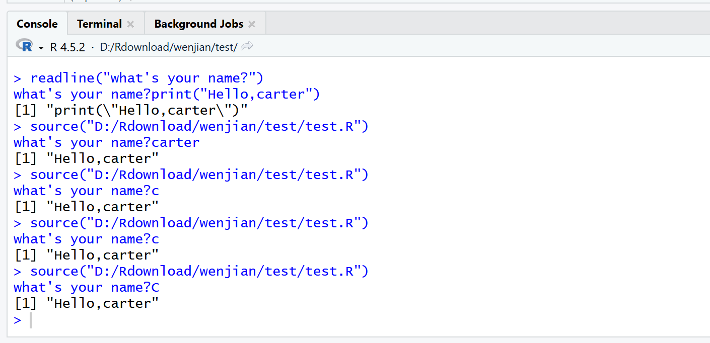
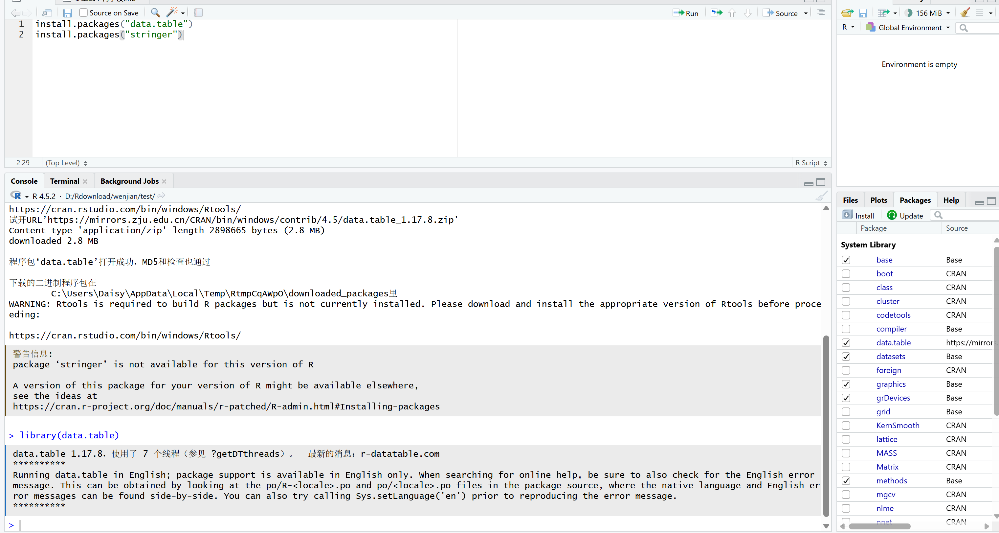
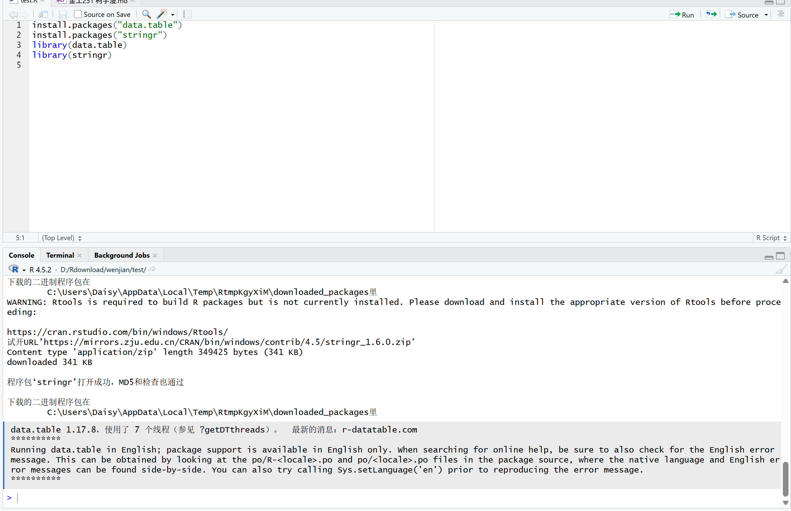
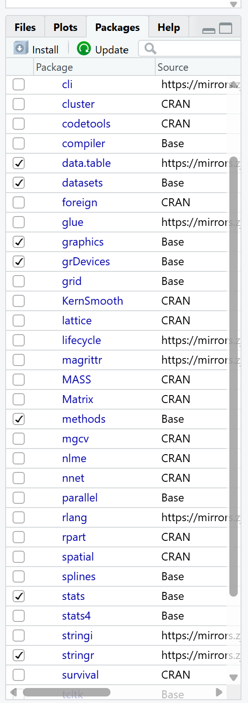
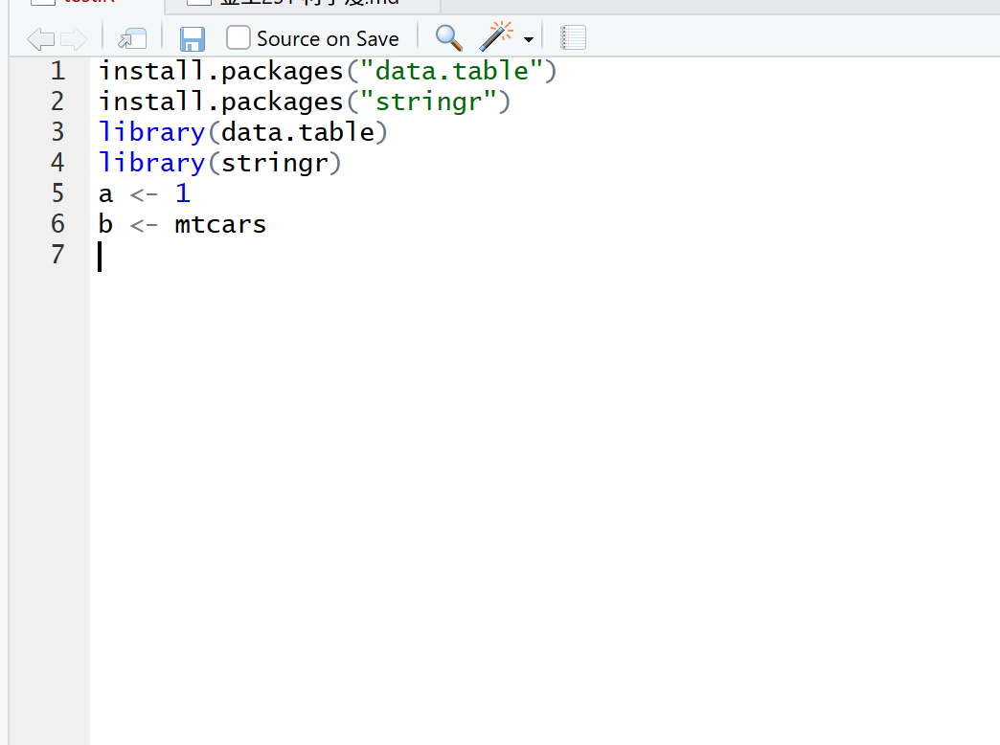
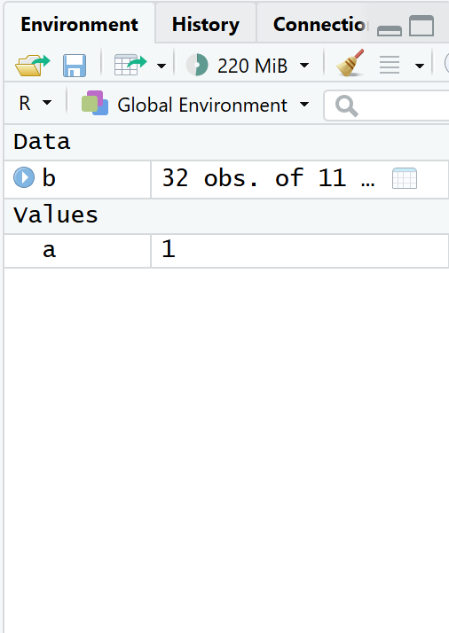

# **作业1**

1\.
R语言是一门**解释性语言**，起源于S语言（John在贝尔实验室带头开发的S语言），主要用来做**数据科学、数据可视化、数据分析、研究或统计学**领域。

2\.
Rstudio是一个专门为R语言构建的并且只能用来编辑R语言的**编辑器**。它和R语言区别在于Rstudio是一个图形化界面，用户易懂；而R语言就是一行行代码，界面相对简陋，相对于Rstudio更难操作。

3\.

4\.

5\.

6\.

# 作业2

1.只有一行代码：点击页面的Run按钮(Ctrl+Enter)。有多行代码：点击页面中的Source按钮（Ctrl+Shift+S）。

2.Console窗口

3.可以运用**install.packages("下载包名称")**函数

4.可以运用**Library(下载包名称)**函数

可以在**Packages窗口**查看已导入的包

5.包经过安装后，下次再打开相关的test.rproj文件不需要再重新安装包；每一次导入包后，下次再打开相关的test.rpoj文件还是需要再重新导入包的。

6.R语言中进行赋值的符号是 **\<-** ,其快捷键是**Alt+-**

7.可以在Environment窗口可以进行查看

8.注释内容用#号开头，其快捷键是Ctrl+Shift+C
